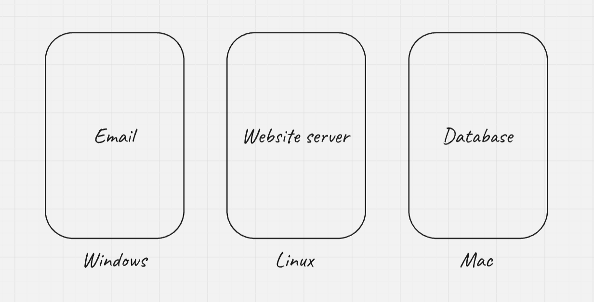
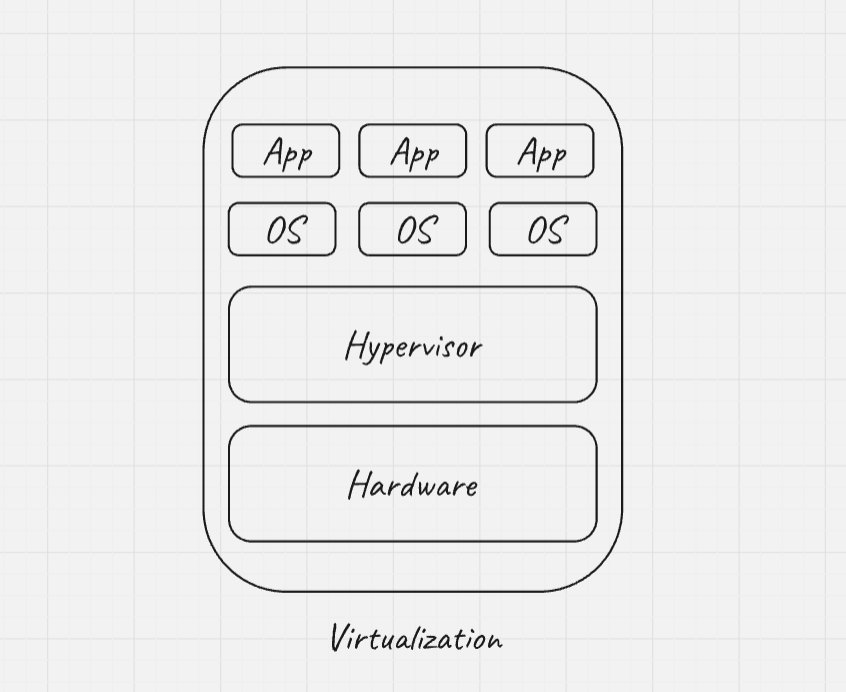
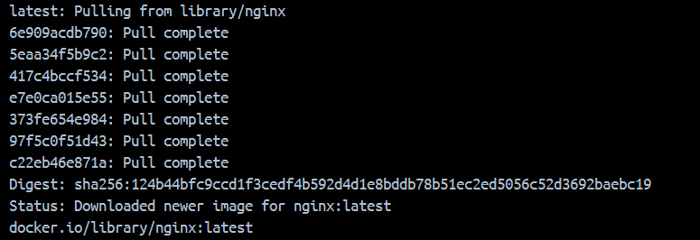
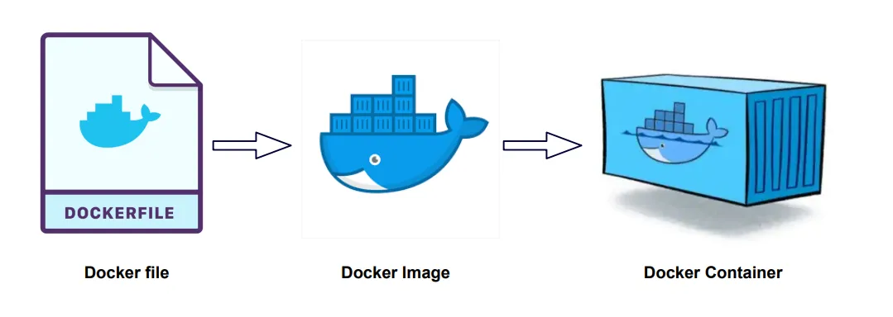
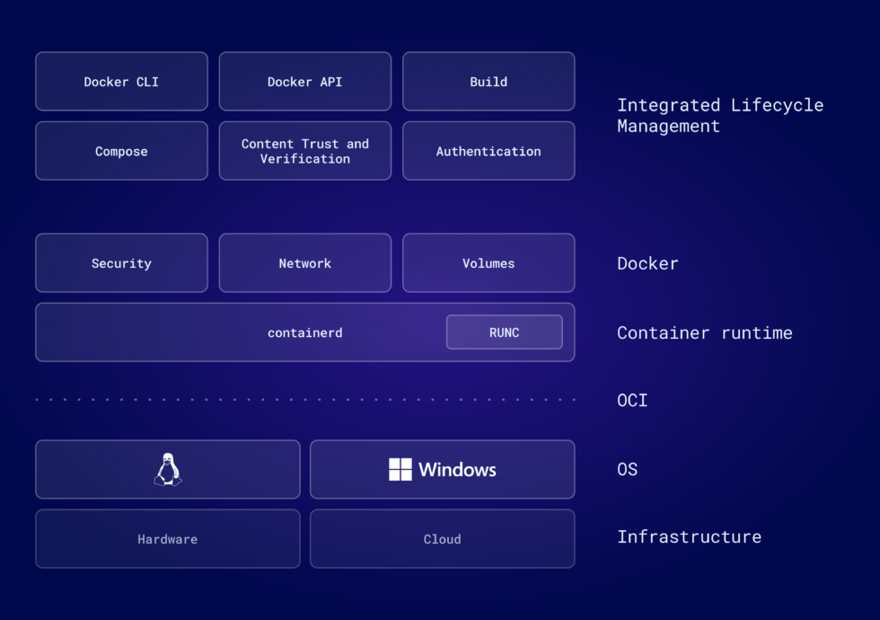
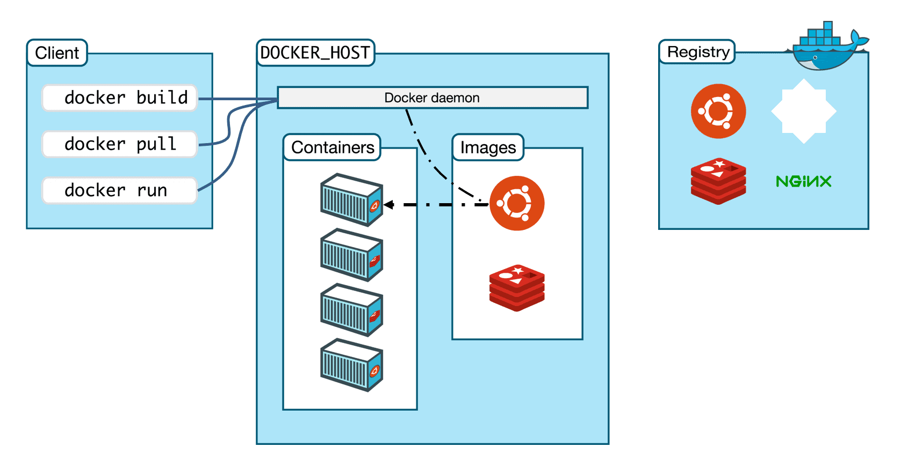
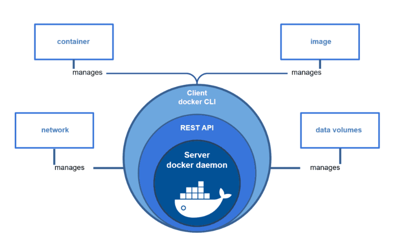
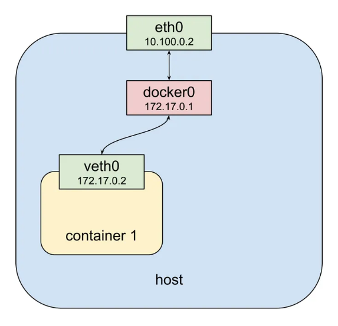
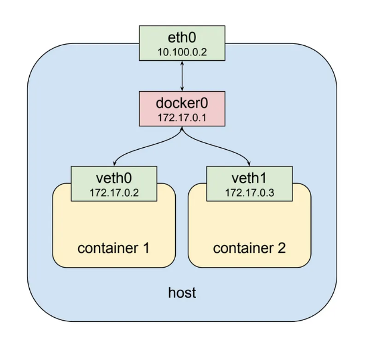
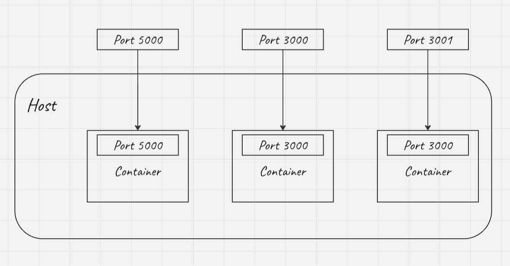

# All About Docker! #

## Features

- Virtualization
- Containerization
- Docker Basics
- Docker Commands
- Docker Architecture
- Docker Volumes
- Docker Networking
- Docker Compose
- Docker Swarm

## Prerequisites

- [Basic Networking](https://cupofcode.medium.com/a-non-scary-introduction-to-computer-networking-cup-of-networks-part-1-9f76583dc8ca) 

## Installation

- [Docker](https://docs.docker.com/engine/install/)
- [Docker Compose](https://docs.docker.com/compose/install/linux/)

Let us start by installing docker and docker compose.

## Virtualization

- Virtualization is the process of simulating hardware and software in a virtual (software) environment.
- Let us understand it by taking an example:



- Let us suppose, we have an application with 3 different services, each running their own operating system.
- Some disadvantages of this type of arrangement:
    - Increased cost: As we have seperate physical machines for every service, the cost increases.
    - Underutilized hardware: Some service may not use all the resource to their full extend.
    - Portability issues: Services are tightly coupled with underlying hardware and operating systems. 
- Now let us see how this issue is solved using virtualization. Before that, let's get to familiarize with some terms related to virtualization.
    1. Virtual machines: A software-based emulation of a physical computer that runs an operating system and applications just like a physical computer does.
    2. Hypervisor: A software layer which manages all the virtual machines.



- By using virtualization, we can use a single physical server for all our services, reducing the number of servers and hardware resourses.
- Each service (Email, Website Server, Database) runs inside its own Virtual Machine (VM).
- Each VM has its own isolated operating system (e.g. Windows, Linux, Mac) and resources, but these are virtualized.
- The resources (like CPU, RAM, and storage) come from the host machine, but they are shared and allocated to each VM by the hypervisor.

- Hypervisors: There are 2 types of hypervisors
    1. Type 1 Hypervisor (Bare-Metal): These run directly on the hardware without a host OS. They manage the hardware and VMs directly. They have high performance because they interact directly with the hardware. They are typically used in Data Centers. e.g. VMware ESXi, Microsoft Hyper-V, XenServer.
    2. Type 2 Hypervisor (Hosted): These run on top of an OS. The hypervisor relies on the host machine for hardware resources. It is great for development and testing. It is slightly slower than type 1 as an extra layer is involved. e.g. VMware Workstation, Oracle VirtualBox, Parallels Desktop.

## Containerization

- Containerization is a lightweight form of virtualization where applications and their dependencies are packaged together into containers. 

### Container

- A container packages an application and its dependencies so that it is able to run on any type of machine.
- It includes everything an application needs to run: the code, runtime, libraries, environment variables and configuration files.
- Containers are isolated from each other and from the host system, but they share the same OS kernel.

- Let us compare how Containerization is more efficient than Virtualization.

### Virtualization VS Containerization

| Virtualization | Containerization |
| --- | --- |
| Each VM requires a full operating system. | Containers share the host OS kernel, so they don’t need a full OS per container. |
| OS level isolation. | Process level isolation. |
| Booting a VM involves starting the entire OS, which may take more time. | Containers start in seconds because they don’t require a full OS boot—only the application and its dependencies need to be initialized. |
| VMs are tied to specific hypervisors or configurations, making them less portable across different environments. | Containers bundle the application with its dependencies, ensuring it runs consistently across development, testing, and production environments, regardless of the underlying OS. |
| Each VM has dedicated resources (CPU, memory, etc.), which can lead to underutilization when applications don’t use all allocated resources. | Containers share resources dynamically. Multiple containers can run on the same host, optimizing hardware utilization. |

## Docker Basics

### Image

- An image can be called as a blueprint of a container.
- It includes the application code, libraries, environment variables and other configuration files.
- Images are immutable. If any changes are made to the running container then they need to be commmitted to create a new image.
- Images are made using something called as a Dockerfile, which we will study further.
- Docker images are built in layers. We have a base layer which is the fundamental layer and then on top of it we have image layers.
- When we run a container, Docker creates a writable layer on top of the image where any changes are stored during the container's lifecycle. See the image below.


- Each layer typically corresponds to a single instruction in the Dockerfile.  
- These layers are stored as read-only files, and Docker can reuse them across different images. e.g. if you have an ubuntu image in your system and image uses the same version of ubuntu, it won't download it again.
- When you create a Docker image, each layer is given a hash value based on its content. This hash is computed using a cryptographic hash function, usually SHA256.



- Docker uses these hashes to identify and cache layers. If the content of a layer hasn't changed, Docker can reuse the cached layer (based on its hash) when building a new image, making the build process faster.
- Images are portable. The image you build on your local machine will work the same way on any other machine with Docker installed.
- Docker images are stored in registries. The most common registry is [Docker Hub](https://hub.docker.com/), but organizations can also create their own private registries.

### Dockerfile

- A Dockerfile is a text file containing a series of instructions to automate the process of building a Docker image.
- It defines the environment, software dependencies and the application's configuration inside a container.
- Once we have a Dockerfile, we can run the docker build command to create an image based on the instructions in the Dockerfile.
- A dockerfile should always be named "Dockerfile" with a capital D.
- Dockerfile instructions:
    - FROM: Specifies the base image for our container.
    - WORKDIR: Sets the working directory in the container. All the subsequent commands will be run from this directory.
    - COPY: Copies the files from your local machine into the container’s WORKDIR.
    - RUN: Used to execute any Linux command inside the container while building the image.
    - CMD: It is an entry-point command. The first command to get executed when the container starts.
    - EXPOSE: Exposes a port so that the container can be accessed on that port.
    - ENV: Used to define environment variables.
    - ADD: Similar to COPY, but can also handle remote URLs and automatically unpack compressed files e.g. tar.
    - ENTRYPOINT: This defines a fixed command that will always run when the conatiner starts.
    - VOLUME: Creates a mount point with a specified path, allowing persistent data to be stored outside the container. More on volumes further. 

- Example dockerfile

```text
FROM node:16
WORKDIR /app
COPY package*.json ./
RUN npm install
COPY . .
EXPOSE 3000
CMD ["npm", "start"]
```

### Container

- Container is a running instance of an image.
- Containers are lightweight.
- Each Docker container has its virtual file system.
- The container FS is temporary, so the data inside the file system is also not persistent.



### Container Runtime

- A container runtime is the software that is responsible for running containers on a system.
-  It manages the lifecycle of containers, including their creation, execution and termination.
- The container runtime interacts directly with the host operating system's kernel to allocate resources, manage networking and control the containers. 
- Some examples of container runtime are runc, docker, containerd, CRI-O and podman.
- Work of container runtime: pull the image -> start the container -> execute the container -> manage container's lifecycle
- Before moving forward, let us take a look at [OCI](https://opencontainers.org/).
- The Open Container Initiative (OCI) is a Linux Foundation project to design open standards for containers.
- Types of container runtime:
    1. Low-level 
        - Any container engine that implements the Open Container Initiative (OCI) runtime specification is considered to be a low-level container runtime.
        - Handle the core part such as lifecycle of containers, including creation, execution, pausing and termination.
        - They interact directly with the operating system's kernel and container-specific features like namespaces and cgroups to isolate and manage containers.
        - e.g. runc, containerd-shim
    2. High-level
        - High-level container runtimes are tools that provide user-friendly interfaces and additional features for managing containers, building upon the functionality of low-level container runtimes. 
        - Provide orchestration, networking, and image management.
        - These runtimes abstract the complexities of directly interacting with low-level runtimes and kernel features.
        - e.g. Docker, Podman, CRI-O, containerd
        - containerd is basically considered as a bridge between low-level and high-level runtimes.
- Hope the below image will be clear now:


    
## Docker Commands

- Docker runs as a root process on the system and thus require root privileges. So, always use 'sudo' before any Docker command.
- Avoid using sudo everytime?: We can add our user to the Docker group (which has the necessary privileges to access Docker resources).
```bash
sudo usermod -aG docker $USER
```

| Command | Description |
| --- | --- |
| `docker images` | List all the images |
| `docker pull <image>:<tag>` | Download an image from the registry |
| `docker build -t <image>:<tag> <path_to_dockerfile>` | Build an image from the dokcerfile |
| `docker rmi <image_name_or_id>` | Delete an image |
| `docker tag <source_image>:<tag> <target_image>:<tag>` | Add tag to an image |
| `docker push <image>:<tag>` | Push an image to the registry |
| `docker inspect <image>:<tag>` | Display detailed information about an image |
| `docker ps` | List all the running docker containers |
| `docker ps -a` | List all the running, stopped as well as created docker containers |
| `docker start <container_name_or_id>` | Start a stopped container |
| `docker stop <container_name_or_id>` | Stop a running container |
| `docker restart <container_name_or_id>` | Restart a container |
| `docker run <image>` | Create and start a container of the image |
| `docker run -d <image>` | Run a container in detached mode (background) |
| `docker run -it <image>` | Run a container interactively (with terminal) |
| `docker run --name <container_name> <image>` | Run a container with a custom name |
| `docker run -p <host_port>:<container_port>` | Map a port from container to the host |
| `docker exec -it <container_name_or_id> <command>` | Executes a command inside a running container |
| `docker inspect <container_name_or_id>` | Provide detailed information about the container |
| `docker rm <container_name_or_id>` | Remove a stopped container |
| `docker rm -f <container_name_or_id>` | Forcefully remove a running container |
| `docker container prune` | Remove all unused containers |
| `docker attach <container_name_or_id>` | Attach to a running containers console |

## Docker Architecture

- Docker uses a client-server architecture.
- The docker client (CLI) talks to the docker daemon (a background process) which in turns manages the lifecycle of containers.
- Various components of the docker architecture:
    1. Docker client: Provides a command-line interface (CLI) that allows users to interact with the docker daemon.
    2. Docker daemon: Listens to Docker API requests and manages Docker objects such as images, containers, networks and volumes.
    3. Docker host: Provides a complete environment to execute and run containers. It comprises of the Docker daemon, Images, Containers, Networks and Storage. 
    4. Docker registry: Stores docker images.



### Docker Engine

- The docker engine is the main component of the docker architecture.
- It is also a high-level container runtime which uses containerd which further uses runc (low-level container runtime). 
- But it is more than a runtime, it is a complete containerization platform.
- It consists of 3 important parts:
    1. Docker daemon (dockerd): Manages docker objects, listens to API requests from clients, communicates with the container runtime to perform low level tasks creating, starting, stopping containers, etc.
    2. Docker REST API: REST API provide interface for interacting with docker daemon, docker CLI uses this API to communicate with docker daemon.
    3. Docker CLI: A command-line tool that developers and administrators use to interact with the docker daemon. 



## Docker Volumes

- Docker containers store stateless applications very easily, because containers are EPHEMERAL in nature.
- If a container crashes or is removed, any data created inside the container (like logs, uploads, database data) is lost.
- So, to have data consistency, the concept of volumes was introduced.
- Volumes are a mechanism for storing data outside containers.
- We create volumes on our host systems and they are mounted to filesystem paths in your containers.
- When containers write to a path beneath a volume mount point, the changes will be applied to the volume instead of the container’s writable image layer. 
- All volumes are managed by Docker and stored in a dedicated directory on your host, usually /var/lib/docker/volumes for Linux systems.
- We can use volumes for stateful applications.
- Usecases: 
    1. Database storage
    2. Data backups
    3. Share data between containers

### Bind Mounts

- Bind mounts are another way to give containers access to files and folders on your host.
- They directly mount a host directory into your container. 
- Any Changes made to the host directory or container directory will be reflected on both the sides.
- Bind mounts are useful when you need to quickly link a directory or file from your host system into a container - typically for temporary or development tasks.
- For example: bind mounting our working directory into a container automatically synchronizes our source code files, allowing us to immediately test changes without rebuilding your Docker image.
- Volumes are a better solution when we're providing permanent storage. Because they’re managed by Docker, we don’t need to manually maintain directories on your host.
- How to bind mount a container: docker run -v /host_path:/container_path <image>

### tmpfs Mounts

- Tmpfs mounts allow you to mount a temporary file system into a container’s filesystem, which resides in memory rather than on disk.
- Tmpfs mounts in Docker can be particularly useful for improving performance or reducing wear on disk storage in situations where temporary data needs to be quickly accessed and doesn’t need to persist beyond the lifetime of the container.
- When the container stops, the tmpfs mount is removed, and files written there won't be persisted.
- How to temporarily mount file system to a container: docker run --tmpfs /container_tmp_path <image>

### Volume Types

- There are 2 types of volumes:
    1. Named
    2. Anonymous

1. Named volumes:
    - Managed by Docker and has a specific name that we can refer across containers.
    - They are used to share data between containers
    - They are used if we need long term storage.

2. Anonymous volumes:
    - Volume created by Docker without a name — it is assigned a random name in the background.
    - They are hard to track.
    - They are temporary storage when you don’t need to reuse the volume.

### Data sharing using volumes

- Named volumes are used for sharing data across containers.
- We can mount a single volumes to 2 different containers.
- Let us suppose we mount a named volume to /app1 of container 1 and /app2 of container 2, whenever any data is written in /app1 it will be written into /app2 and vice-versa.
- This is how data sharing works in containers using named volumes.

## Volume Commands

| Command | Description |
| --- | --- |
| `docker volume ls` | List all the volumes in the system |
| `docker volume create <volume_name>` | Create a volume |
| `docker volume inspect <volume_name>` | Get more information about a volume |
| `docker volume rm <volume_name>` | Remove a volume |
| `docker volume prune` | Remove all unused volumes
| `docker run -v <volume_name>:/container_directory <image_name>` | Use a volume with a container |

## Docker Networking

- We containerize different components of our application separately for a multi-containerized application.
- These parts need to communicate with each other.
- Container to container communication is carried out by docker networking.
- When we install docker, it creates a virtual network on our host for containers to communicate.
- As similar to usual networking of our devices, docker containers are also identified by IP addresses while communicating.
- Docker has an IP address range to it.
- By default, Docker uses private IP ranges from the RFC 1918 standard - just like our home Wi-Fi might use 192.168.x.x or 10.x.x.x.



- As we can see in the image above, whenever a container is created docker creates a virtual network called as docker0 (More about it further) through which the containers communicate. 
- eth0 is the network interface of the host. 
- For every container a virtual ethernet (veth) pair is created. 
- The docker0 acts as a gateway between the eth0 of the host and the veth0 of the container for them to communicate.



- From the above image we can see that, for every container, a different pair of veth is created.
- All the containers also communicate through the bridge.

### Types of Networks

- There are total 7 types of networks in docker.

1. Default bridge network:
    - It is also called as Docker0.
    - Whenever we spin up a container without defining any specific network, it is by default added into the default bridge network.
    - Containers talk to each other by using their IP addresses.
    - The scope of this network is for a single host.
    - In default bridge network, containers cannot resolve each others' names from IP addresses, so they cannot talk to each other using the container names.
    - The default bridge network typically uses IP address range: 172.17.0.0/16 - 172.17.255.254/16

2. User-defined bridge network:
    - We can create our own networks with any names.
    - We need to explicitly add containers in these networks.
    - Here, containers communicate via IP addresses as well as container names as DNS is available.
    - The user-defined bridge network typically uses IP address range: 172.18.0.0/16 - 172.31.0.0/16 

- Bridge networks create a connection between:
    - containers connected to the same network
    - container and the host

3. Host:
    - By default containers are network-isolated from the host, but containers on a host network share the host's network stack.
    - There is no container-level isolation.
    - It can be used for high performance workloads, where routing, Network Address Translation (NAT) and DNS resolutions could affect.
    - The container is inside the host's network — no virtual network, no NAT, no bridge. (We'll see more about NAT further)
    - If we run an nginx service a docker container and if nginx serves on port 80, we cannot access the nginx server on http://localhost:80 as docker containers have their own IP addresses, so we need to perform port mapping. (More about port mapping later)
    - If we use host network, the container does not get an IP address, it shares the IP address of the host itself, so the service would be accessible on localhost port 80.
    - In some conditions, using the host network is more efficient.

4. None:
    - The container does not get added to any network at all.
    - It is mostly used for useful for security testing or sandboxed apps.
    - It is also used for compute-only containers which do not need any network access.

5. Overlay:
    - This network is the magic behind Docker Swarm (We will learn it further) and multi-host container networking. 
    - An overlay network lets containers running on different Docker hosts communicate as if they’re on the same local network - securely and efficiently.
    - Imagine you have two VMs: VM1 runs container A and VM2 runs container B. Using an overlay network A and B can talk to each other using their container names and It feels like they’re both on the same Local Area Network (LAN), even though they’re on different machines.
    - How overlays work under the hood?
        1. VXLAN tunneling: Docker uses VXLAN (Virtual eXtensible LAN) to encapsulate network packets and send them across machines.
        2. Gossip protocol: Docker nodes exchange network info using encrypted gossip (We will see further) to maintain the overlay state.
        3. Routing mesh: Allows incoming traffic to be routed to any node, and Docker redirects it to the correct container.
        4. Service discovery: Docker manages internal DNS so containers can talk using service names, not IPs.
    - So, we can say overlay networks make us think that the containers are in a user-defined bridge network on the same machine.

6. Macvlan:
    - Macvlan allows Docker containers to have their own MAC address and IP address, as if they were separate physical machines on our LAN.
    - In contrast to bridge or overlay, which use NAT and virtual subnets, macvlan connects containers directly to our host's physical network.
    - It makes our container act as a physical real-world device.
    - Our host has an IP address in our LAN, for the mcvlan network we need to take a subnet range from the LAN and assign the IP addresses to the containers manually.
    - For MAC addresses, docker will generate a random MAC address for each container in the network.
    - Macvlan gives each container its own IP - no need for Docker to forward ports from host.
    - Macvlan network is used when other devices on the LAN (laptops, printers, IoT stuff) need to connect to containers directly.
    - In a macvlan network, by default, the host cannot communicate with the containers, even though they’re on the same subnet.
    - Why? In mcvlan, both host and container are using the same physical Network Interface Card (NIC) which is eth0. Linux kernel has a weird rule which says: we can’t send traffic from eth0 to macvlan0 and expect it to come back in via the same interface. So the host and container cannot communicate with each other.

7. Ipvlan:
    - Ipvlan lets containers appear on the same network as the host, with individual IP addresses, but using the same MAC address.
    - Unlike macvlan, ipvlan doesn't create a separate MAC for each container.
    - There are two modes of ipvlan, depending on how packets are sent between host and container:
        1. L2: Works like a switch: assigns containers IPs on the same subnet as the host
        2. L3: Works like a router: assigns IPs from a different subnet, routes traffic
    - In ipvlan, only IP address is different, the MAC is same and physical NIC is same as the host so host and container can communicate with each other.

### Port Mapping

- Docker isolates the containers by default, from the host.
- The containers have their own network stack and networking namespaces.
- For us to access the services running inside the container, we need to map ports from host to the container, this is called port mapping.



- There are 2 different things: Exposing a port and publishing a port.
- Many times, people get confused in these two. Let's clear the difference.
- Expose: 
    - Acts as documentation to indicate which port the app inside the container is listening on. 
    - It does not actually make the port accessible from the host or outside world. 
    - If we have EXPOSE 5000, this just tells Docker: “Hey, this container listens on port 5000”.
    - We expose the ports mainly in the dockerfile using EXPOSE.
- Publish: 
    - Actually binds a container port to a port on the host machine.
    - Makes the container's port accessible to the outside (e.g., browser, Postman, etc.)
    - We publish the port while creating a container using the -p or --publish flag.

## Networking Commands

| Command | Description |
| --- | --- |
| `docker network ls` | List all the networks in the system |
| `docker network create <network_name>` | Create a user-defined bridge network |
| `docker network inspect <network_name>` | Get more information about the network |
| `docker network rm <network_name>` | Remove the network if not containers are attached to it |
| `docker network connect <network_name> <container_name>` | Connect a running container to a network |
| `docker network disconnect <network_name> <container_name>` | Disconnect a container from a network |
| `docker run --network <network_name> <image_name>` | Run a container with a custom network |
| `docker network prune` | Remove all unused docker networks |
| `docker run -d -p <host_port>:<container_port> <image_name>` | Publish a port |

## Docker Compose

- Docker compose is a tool which makes running multi-container applications easy.
- If we have an application having, let us say 1000 containers, it will be quite cumbersome to run all the 1000 containers everytime we want to start the application.
- Here, docker compose comes into play. We have something called as a compose file or YAML file which runs all these containers at once, simplifying our work.

### YAML file

- YAML stands for "Yet Another Markup Language" or " YAML ain't Markup Language".
- YAML is not a traditional markup language like HTML or XML. Instead, it's designed to be a human-readable data serialization format — simple, clean, and easy to write and read.
- INDENTATION is very important in a YAML file. Pay special attention to it.
- The YAML file is a configuration file which defines how all the containers will run.
- The containers are called as services in the YAML file, as each container has one service defined for it.
- The YAML file has .yaml or .yml extension.
- This is how a YAML file looks like:

```yaml

version: '3.9'

services:
  web:
    image: nginx:latest
    ports:
      - "8080:80"
    volumes:
      - ./html:/usr/share/nginx/html
    environment:
      - NGINX_HOST=localhost
    depends_on:
      - app
    networks:
      - frontend

  app:
    build:
      context: ./app
      dockerfile: Dockerfile
    ports:
      - "5000:5000"
    environment:
      - FLASK_ENV=development
    volumes:
      - ./app:/app
    networks:
      - frontend
      - backend

  db:
    image: mysql:5.7
    restart: always
    environment:
      MYSQL_ROOT_PASSWORD: rootpass
      MYSQL_DATABASE: mydb
    volumes:
      - db_data:/var/lib/mysql
    networks:
      - backend

volumes:
  db_data:

networks:
  frontend:
  backend:

```

1. Version: specifies the version of the compose file syntax.
2. Services: Defines the different containers the app needs to run.
3. Web, app, db: These are individual services (containers) - each one is a separate container running a task.
4. Image: This defines the base image the container is running on. If we locally have the image it is used or it is pulled from DockerHub.
5. Build: Defines how to build an image from a dockerfile. We give the location / path of dockerfile in the context field and dockerfile name in the dockerfile field.
6. Ports: This is used for port mapping. Syntax: <host_port>:<container_port>
7. Volumes (inside services): Mounts a directory or file from the host into the container. Uses the volume specified in the main Volume component.
8. Environment: Sets environment variables inside the container.
9. Depends_on: Sets the execution sequence of containers / services. If we have frontend depends_on backend, then backend starts before frontend.
10. restart: Tells Docker how to handle container restarts. "always" means restart it if it crashes.
11. Volumes: Declares named volumes (like db_data) to persist data across container restarts or rebuilds.
12. Networks: Declares custom Docker networks. Without this, all services are put in a default network.

### Compose Commands

| Command | Description |
| --- | --- |
| `docker-compose up` | Create and start services defined in docker-compose.yml |
| `docker-compose down` | Stops and removes containers, networks and by default, anonymous volumes |
| `docker-compose restart` | Restart the services |
| `docker-compose rm` | Remove the containers |
| `docker-compose stop` | Stop all services/containers defined in docker-compose.yml |
| `docker-compose start` | Start all services/containers that were stopped |

## Docker Swarm

- Docker Swarm is a container orchestration tool provided by Docker.
- Orchestration means automating the deployment, management, scaling and networking of containers.
- For multi-container applications we used docker compose, but the containers are to be on the same host for it.
- Docker swarm lets us connect containers to multiple hosts, similar to Kubernetes.
- Instead of running containers on just one machine, Swarm lets us run them across multiple machines and manages all of them together efficiently.
- Docker swarm offers more scalability and availability.
- Stack in Swarm: Instead of running one service at a time, a stack lets us deploy the entire app at once using a single "docker-compose.yml" file.
- Tokens in swarm: A token is a secret string that lets a machine join to a Docker Swarm. There are 2 kinds of tokens - worker and manager and they control the role of the node. When we initialize a Swarm, these 2 tokens are created.
- Docker Swarm uses port 2377 to control traffic.

### Docker Swarm Components

1. Cluster:
    - Group of machines running docker.

2. Node:
    - A node is a single Docker engine (physical / virtual machine running docker) participating in the swarm.
    - Nodes can be of two types: 
      1. Manager Node:
        - Orchestrates and manages the swarm.
        - Maintains the cluster state.
        - Responsible for scheduling services, handling orchestration and cluster management.
      2. Worker Node:
        - Executes containers as instructed by the manager.
        - Does not participate in orchestration decisions.
    - A manager node can also act as a worker node if needed.
    - A cluster consists of multiple manager and worker nodes.

3. Services:
    - Services are the desired state that we want to run.
    - It defines how a container should run inside a Swarm.
    - Example: running an Nginx container replicated 5 times.

4. Tasks:
    - The actual running instances of a container in Swarm.
    - The main working unit in Swarm.
    - Tasks are assigned to worker nodes.

### Connection between Service and Node:

- When you create a service, Swarm breaks it down into tasks (individual container instances).
- The manager node schedules these tasks onto available worker nodes.
- Each node then runs the assigned containers.
- Think of it like this:
  - Service = "recipe" (what to run, how many times, what image).
  - Tasks = "dishes" prepared from the recipe (container instances).
  - Nodes = "chefs" (machines) that actually cook the dishes.

### Swarm Commands

Swarm Management

| Command | Description |
| --- | --- |
| `docker swarm init` | Initialize a new Swarm |
| `docker swarm join --token <token> <manager-ip>:2377` | Join Swarm |
| `docker swarm join-token manager` | Get token to add new manager |
| `docker swarm join-token worker` | Get token to add new worker |
| `docker swarm leave` | Leave Swarm |
| `docker swarm update --autolock=true` | Update Swarm config |

Node Management

| Command | Description |
| --- | --- |
| `docker node ls` | List all nodes |
| `docker node inspect <node>` | Inspect a node |
| `docker node update --availability drain <node>` | Drain node |
| `docker node promote <node>` | Promote node from worker to manager |
| `docker node demote <node>` | Demote node from manager to worker |
| `docker node rm <node>` | Remove node |

Service Management

| Command | Description |
| --- | --- |
| `docker service create --name <service_name> -p <host_port>:<container_port> <image>` | Create service |
| `docker service ls` | List services |
| `docker service ps <service_name>` | List tasks/containers of service |
| `docker service update --replicas=5 <service_name>` | Scale service |
| `docker service update --image <image>:latest <service_name>` | Update image |
| `docker service logs <service_name>` | View service logs |
| `docker service rm <service_name>` | Remove service |

Stack Management

| Command | Description |
| --- | --- |
| `docker stack deploy -c docker-compose.yml <stack_name>` | Deploy stack |
| `docker stack ls` | List stacks |
| `docker stack ps <stack_name>` | List tasks in stack |
| `docker stack services <stack_name>` | List services in stack |
| `docker stack rm <stack_name>` | Remove stack |

Useful Commands

| Command | Description |
| --- | --- |
| `docker info` | Show Swarm status |
| `docker service inspect <service>` | Inspect service |
| `docker node inspect self` | Inspect current node |


