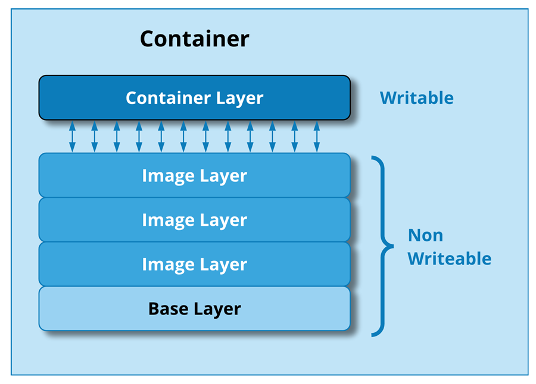

# All About Docker! #

## Features

- Virtualization
- Containerization
- Docker Basics
- Docker Commands
- Docker Architecture
- Docker Volumes
- Docker Networking
- Docker Compose
- Docker Swarm

## Prerequisites

- [Basic Networking](https://cupofcode.medium.com/a-non-scary-introduction-to-computer-networking-cup-of-networks-part-1-9f76583dc8ca) 

## Installation

- [Docker](https://docs.docker.com/engine/install/)
- [Docker Compose](https://docs.docker.com/compose/install/linux/)

Let us start by installing docker and docker compose.

## Virtualization

- Virtualization is the process of simulating hardware and software in a virtual (software) environment.
- Let us understand it by taking an example:


- Let us suppose, we have an application with 3 different services, each running their own operating system.
- Some disadvantages of this type of arrangement:
    - Increased cost: As we have seperate physical machines for every service, the cost increases.
    - Underutilized hardware: Some service may not use all the resource to their full extend.
    - Portability issues: Services are tightly coupled with underlying hardware and operating systems. 
- Now let us see how this issue is solved using virtualization. Before that, let's get to familiarize with some terms related to virtualization.
    1. Virtual machines: A software-based emulation of a physical computer that runs an operating system and applications just like a physical computer does.
    2. Hypervisor: A software layer which manages all the virtual machines.


- By using virtualization, we can use a single physical server for all our services, reducing the number of servers and hardware resourses.
- Each service (Email, Website Server, Database) runs inside its own Virtual Machine (VM).
- Each VM has its own isolated operating system (e.g. Windows, Linux, Mac) and resources, but these are virtualized.
- The resources (like CPU, RAM, and storage) come from the host machine, but they are shared and allocated to each VM by the hypervisor.

- Hypervisors: There are 2 types of hypervisors
    1. Type 1 Hypervisor (Bare-Metal): These run directly on the hardware without a host OS. They manage the hardware and VMs directly. They have high performance because they interact directly with the hardware. They are typically used in Data Centers. e.g. VMware ESXi, Microsoft Hyper-V, XenServer.
    2. Type 2 Hypervisor (Hosted): These run on top of an OS. The hypervisor relies on the host machine for hardware resources. It is great for development and testing. It is slightly slower than type 1 as an extra layer is involved. e.g. VMware Workstation, Oracle VirtualBox, Parallels Desktop.

## Containerization

- Containerization is a lightweight form of virtualization where applications and their dependencies are packaged together into containers. 

# Container

- A container packages an application and its dependencies so that it is able to run on any type of machine.
- It includes everything an application needs to run: the code, runtime, libraries, environment variables and configuration files.
- Containers are isolated from each other and from the host system, but they share the same OS kernel.

- Let us compare how Containerization is more efficient than Virtualization.

# Virtualization VS Containerization

| Virtualization | Containerization |
| --- | --- |
| Each VM requires a full operating system. | Containers share the host OS kernel, so they don’t need a full OS per container. |
| OS level isolation. | Process level isolation. |
| Booting a VM involves starting the entire OS, which may take more time. | Containers start in seconds because they don’t require a full OS boot—only the application and its dependencies need to be initialized. |
| VMs are tied to specific hypervisors or configurations, making them less portable across different environments. | Containers bundle the application with its dependencies, ensuring it runs consistently across development, testing, and production environments, regardless of the underlying OS. |
| Each VM has dedicated resources (CPU, memory, etc.), which can lead to underutilization when applications don’t use all allocated resources. | Containers share resources dynamically. Multiple containers can run on the same host, optimizing hardware utilization. |

## Docker Basics

# Image

- An image can be called as a blueprint of a container.
- It includes the application code, libraries, environment variables and other configuration files.
- Images are immutable. If any changes are made to the running container then they need to be commmitted to create a new image.
- Images are made using something called as a Dockerfile, which we will study further.
- Docker images are built in layers. We have a base layer which is the fundamental layer and then on top of it we have image layers.
- When we run a container, Docker creates a writable layer on top of the image where any changes are stored during the container's lifecycle. See the image below.



- Each layer typically corresponds to a single instruction in the Dockerfile.  
- These layers are stored as read-only files, and Docker can reuse them across different images. e.g. if you have an ubuntu image in your system and image uses the same version of ubuntu, it won't download it again.
- When you create a Docker image, each layer is given a hash value based on its content. This hash is computed using a cryptographic hash function, usually SHA256.


- Docker uses these hashes to identify and cache layers. If the content of a layer hasn't changed, Docker can reuse the cached layer (based on its hash) when building a new image, making the build process faster.
- Images are portable. The image you build on your local machine will work the same way on any other machine with Docker installed.
- Docker images are stored in registries. The most common registry is [Docker Hub](https://hub.docker.com/), but organizations can also create their own private registries.

# Dockerfile

- A Dockerfile is a text file containing a series of instructions to automate the process of building a Docker image.
- It defines the environment, software dependencies and the application's configuration inside a container.
- Once we have a Dockerfile, we can run the docker build command to create an image based on the instructions in the Dockerfile.
- A dockerfile should always be named "Dockerfile" with a capital D.
- Dockerfile instructions:
    - FROM: Specifies the base image for our container.
    - WORKDIR: Sets the working directory in the container. All the subsequent commands will be run from this directory.
    - COPY: Copies the files from your local machine into the container’s WORKDIR.
    - RUN: Used to execute any Linux command inside the container while building the image.
    - CMD: It is an entry-point command. The first command to get executed when the container starts.
    - EXPOSE: Exposes a port so that the container can be accessed on that port.
    - ENV: Used to define environment variables.
    - ADD: Similar to COPY, but can also handle remote URLs and automatically unpack compressed files e.g. tar.
    - ENTRYPOINT: This defines a fixed command that will always run when the conatiner starts.
    - VOLUME: Creates a mount point with a specified path, allowing persistent data to be stored outside the container. More on volumes further. 

- Example dockerfile

```yaml
FROM node:16
WORKDIR /app
COPY package*.json ./
RUN npm install
COPY . .
EXPOSE 3000
CMD ["npm", "start"]
```

# Container

- Container is a running instance of an image.
- Containers are lightweight.
- Each Docker container has its virtual file system.
- The container FS is temporary, so the data inside the file system is also not persistent.

# Container runtime

- A container runtime is the software that is responsible for running containers on a system.
-  It manages the lifecycle of containers, including their creation, execution and termination.
- The container runtime interacts directly with the host operating system's kernel to allocate resources, manage networking and control the containers. 
- Some examples of container runtime are runc, docker, containerd, CRI-O and podman.
- Work of container runtime: pull the image -> start the container -> execute the container -> manage container's lifecycle
    
## Docker Commands Table

| Command | Description |
| --- | --- |
| `docker ps` | Check all the running docker containers |

## Docker Architecture

## Docker Volumes

## Volume Commands

| Command | Description |
| --- | --- |
| `docker volume ls` | List all the volumes in the system |

## Docker Networking

## Networking Commands

| Command | Description |
| --- | --- |
| `docker network ls` | List all the networks in the system |

## Docker Compose

### YAML file

```yaml
version:

services:
```

## Compose Commands

| Command | Description |
| --- | --- |
| `docker-compose up` | run the compose file |

## Docker Swarm
