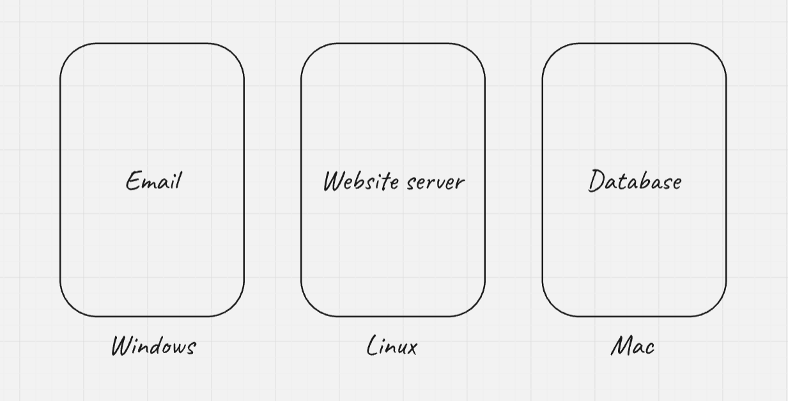
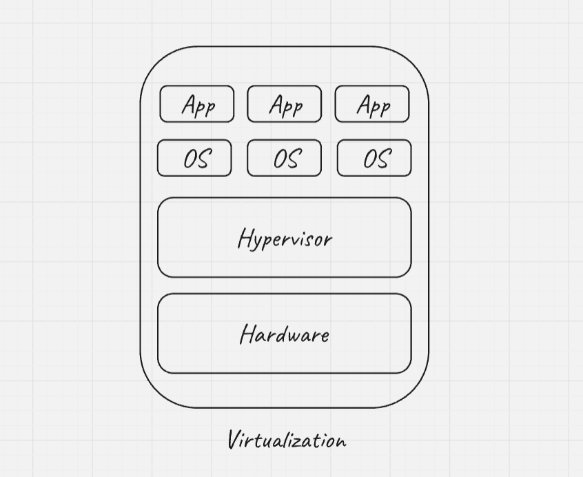

# All About Docker! #

## Features

- Virtualization
- Containerization
- Docker Basics
- Docker Commands
- Docker Architecture
- Docker Volumes
- Docker Networking
- Docker Compose
- Docker Swarm

## Prerequisites

- [Basic Networking](https://cupofcode.medium.com/a-non-scary-introduction-to-computer-networking-cup-of-networks-part-1-9f76583dc8ca) 

## Installation

- [Docker](https://docs.docker.com/engine/install/)
- [Docker Compose](https://docs.docker.com/compose/install/linux/)

Let us start by installing docker and docker compose.

## Virtualization

- Virtualization is the process of simulating hardware and software in a virtual (software) environment.
- Let us understand it by taking an example:
- 
- Let us suppose, we have an application with 3 different services, each running their own operating system.
- Some disadvantages of this type of arrangement:
    - Increased cost: As we have seperate physical machines for every service, the cost increases.
    - Underutilized hardware: Some service may not use all the resource to their full extend.
    - Portability issues: Services are tightly coupled with underlying hardware and operating systems. 
- Now let us see how this issue is solved using virtualization. Before that, let's get to familiarize with some terms related to virtualization.
    1. Virtual machines: A software-based emulation of a physical computer that runs an operating system and applications just like a physical computer does.
    2. Hypervisor: A software layer which manages all the virtual machines.
- 
- By using virtualization, we can use a single physical server for all our services, reducing the number of servers and hardware resourses.
- Each service (Email, Website Server, Database) runs inside its own Virtual Machine (VM).
- Each VM has its own isolated operating system (e.g. Windows, Linux, Mac) and resources, but these are virtualized.
- The resources (like CPU, RAM, and storage) come from the host machine, but they are shared and allocated to each VM by the hypervisor.
- Hypervisor: There are 2 types of hypervisors
    1. Type 1 Hypervisor (Bare-Metal): These run directly on the hardware without a host OS. They manage the hardware and VMs directly. They have high performance because they interact directly with the hardware. They are typically used in Data Centers. e.g. VMware ESXi, Microsoft Hyper-V, XenServer.
    2. Type 2 Hypervisor (Hosted): These run on top of an OS. The hypervisor relies on the host machine for hardware resources. It is great for development and testing. It is slightly slower than type 1 as an extra layer is involved. e.g. VMware Workstation, Oracle VirtualBox, Parallels Desktop.

## Containerization

## Docker Basics

### Image

### Container
    
## Docker Commands Table

| Command | Description |
| --- | --- |
| `docker ps` | Check all the running docker containers |

## Docker Architecture

## Docker Volumes

## Volume Commands

| Command | Description |
| --- | --- |
| `docker volume ls` | List all the volumes in the system |

## Docker Networking

## Networking Commands

| Command | Description |
| --- | --- |
| `docker network ls` | List all the networks in the system |

## Docker Compose

### YAML file

```yaml
version:

services:
```

## Compose Commands

| Command | Description |
| --- | --- |
| `docker-compose up` | run the compose file |

## Docker Swarm
